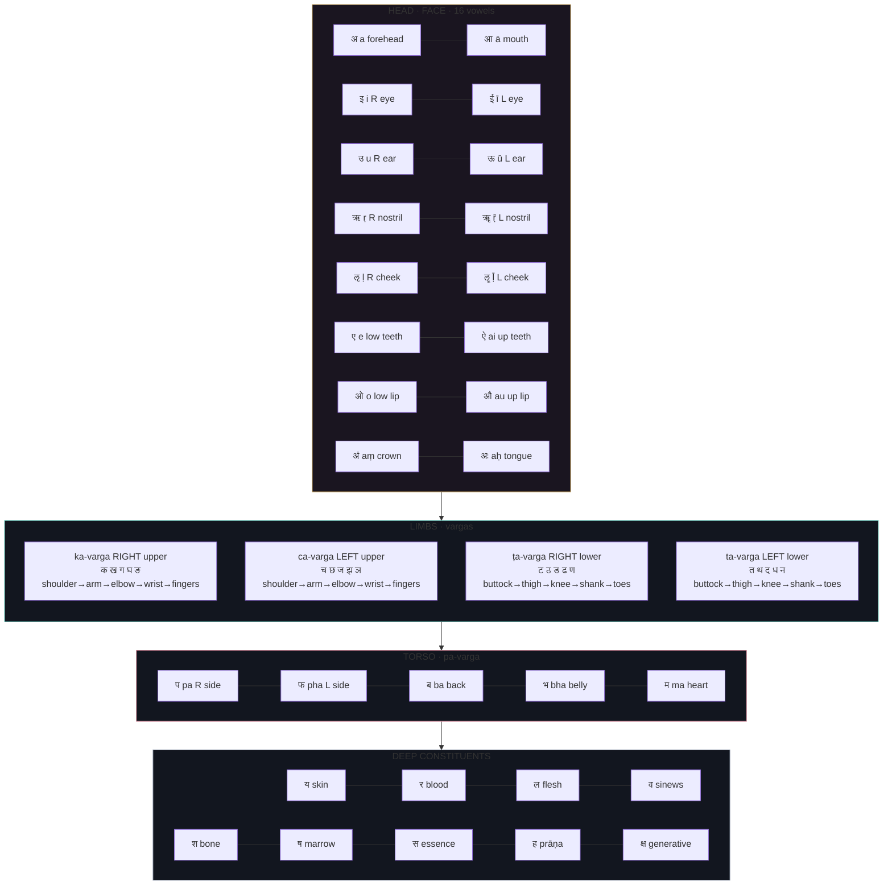
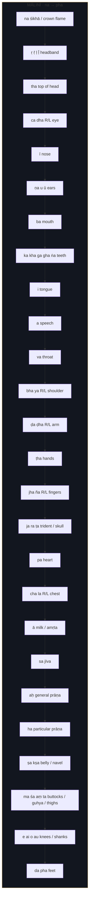
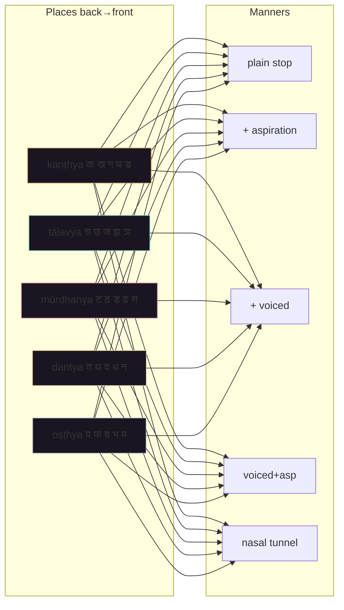
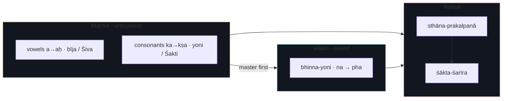

# Phoneme body maps

Live: https://stonedoorway.com/reference/phoneme-maps

## Mātṛkā mermaid

```mermaid
flowchart TB
  subgraph HEAD["HEAD · FACE · 16 vowels"]
    direction LR
    a["अ a forehead"] --- ā["आ ā mouth"]
    i["इ i R eye"] --- ī["ई ī L eye"]
    u["उ u R ear"] --- ū["ऊ ū L ear"]
    ṛ["ऋ ṛ R nostril"] --- ṝ["ॠ ṝ L nostril"]
    ḷ["ऌ ḷ R cheek"] --- ḹ["ॡ ḹ L cheek"]
    e["ए e low teeth"] --- ai["ऐ ai up teeth"]
    o["ओ o low lip"] --- au["औ au up lip"]
    aṃ["अं aṃ crown"] --- aḥ["अः aḥ tongue"]
  end
  subgraph LIMBS["LIMBS · vargas"]
    direction TB
    KA["ka-varga RIGHT upper<br/>क ख ग घ ङ<br/>shoulder→arm→elbow→wrist→fingers"]
    CA["ca-varga LEFT upper<br/>च छ ज झ ञ<br/>shoulder→arm→elbow→wrist→fingers"]
    TA["ṭa-varga RIGHT lower<br/>ट ठ ड ढ ण<br/>buttock→thigh→knee→shank→toes"]
    TN["ta-varga LEFT lower<br/>त थ द ध न<br/>buttock→thigh→knee→shank→toes"]
  end
  subgraph TORSO["TORSO · pa-varga"]
    direction LR
    pa["प pa R side"] --- pha["फ pha L side"] --- ba["ब ba back"] --- bha["भ bha belly"] --- ma["म ma heart"]
  end
  subgraph DEEP["DEEP CONSTITUENTS"]
    direction LR
    ya["य skin"] --- ra["र blood"] --- la["ल flesh"] --- va["व sinews"]
    śa["श bone"] --- ṣa["ष marrow"] --- sa["स essence"] --- ha["ह prāṇa"] --- kṣa["क्ष generative"]
  end
  HEAD --> LIMBS --> TORSO --> DEEP
  style HEAD fill:#1a1520,stroke:#c9a45c
  style LIMBS fill:#12161f,stroke:#5ec4b6
  style TORSO fill:#12161f,stroke:#d4899a
  style DEEP fill:#12161f,stroke:#9aa3b5
```

## Mālinī mermaid

```mermaid
flowchart TB
  subgraph ORDER["MĀLINĪ · na → pha"]
    direction TB
    n1["na śikhā / crown flame"]
    n2["ṛ ṝ ḷ ḹ headband"]
    n3["tha top of head"]
    n4["ca dha R/L eye"]
    n5["ī nose"]
    n6["ṇa u ū ears"]
    n7["ba mouth"]
    n8["ka kha ga gha ṅa teeth"]
    n9["i tongue"]
    n10["a speech"]
    n11["va throat"]
    n12["bha ya R/L shoulder"]
    n13["ḍa ḍha R/L arm"]
    n14["ṭha hands"]
    n15["jha ña R/L fingers"]
    n16["ja ra ṭa trident / skull"]
    n17["pa heart"]
    n18["cha la R/L chest"]
    n19["ā milk / amṛta"]
    n20["sa jīva"]
    n21["aḥ general prāṇa"]
    n22["ha particular prāṇa"]
    n23["ṣa kṣa belly / navel"]
    n24["ma śa aṃ ta buttocks / guhya / thighs"]
    n25["e ai o au knees / shanks"]
    n26["da pha feet"]
    n1-->n2-->n3-->n4-->n5-->n6-->n7-->n8-->n9-->n10
    n10-->n11-->n12-->n13-->n14-->n15-->n16-->n17-->n18-->n19
    n19-->n20-->n21-->n22-->n23-->n24-->n25-->n26
  end
  style ORDER fill:#12161f,stroke:#c9a45c
```

## Articulation mermaid

```mermaid
flowchart LR
  subgraph P["Places back→front"]
    k["kaṇṭhya क ख ग घ ङ"]
    t["tālavya च छ ज झ ञ"]
    r["mūrdhanya ट ठ ड ढ ण"]
    d["dantya त थ द ध न"]
    o["oṣṭhya प फ ब भ म"]
  end
  k --> m1 & m2 & m3 & m4 & m5
  t --> m1 & m2 & m3 & m4 & m5
  r --> m1 & m2 & m3 & m4 & m5
  d --> m1 & m2 & m3 & m4 & m5
  o --> m1 & m2 & m3 & m4 & m5
  subgraph M["Manners"]
    m1["plain stop"]
    m2["+ aspiration"]
    m3["+ voiced"]
    m4["voiced+asp"]
    m5["nasal tunnel"]
  end
  style k fill:#1a1520,stroke:#c9a45c
  style t fill:#1a1520,stroke:#5ec4b6
  style r fill:#1a1520,stroke:#d4899a
  style d fill:#1a1520,stroke:#e8d5a3
  style o fill:#1a1520,stroke:#9aa3b5
```

## Compare

```mermaid
flowchart LR
  subgraph MK["Mātṛkā · articulated"]
    vowels["vowels a→aḥ · bīja / Śiva"]
    cons["consonants ka→kṣa · yoni / Śakti"]
  end
  subgraph ML["Mālinī · mixed"]
    mix["bhinna-yoni · na → pha"]
  end
  subgraph NY["Nyāsa"]
    sth["sthāna-prakalpanā"]
    body["śākta-śarīra"]
    sth --> body
  end
  MK -->|"master first"| ML
  MK --> NY
  ML --> NY
  style MK fill:#12161f,stroke:#c9a45c
  style ML fill:#12161f,stroke:#5ec4b6
  style NY fill:#12161f,stroke:#d4899a
```
